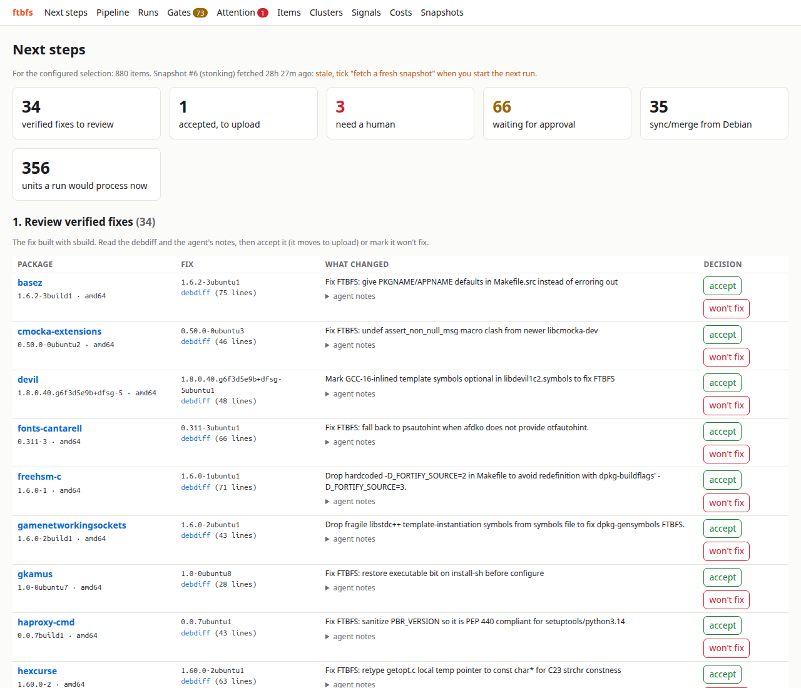

# ftbfs - agentic review of Ubuntu FTBFS

The Ubuntu development series carries around a thousand packages that
fail to build from source (FTBFS) at any time, listed on
<http://qa.ubuntuwire.com/ftbfs/>. Each one starts with someone reading
a long build log. Most share a few causes (a new compiler, glibc or
CMake, a missing dependency) and many are already fixed in Debian.

ftbfs reviews that list for you. It cuts every log down to the failure,
groups failures with the same cause, checks Debian, and asks LLM agents
for a verdict and a diagnosis once per group. Then it reproduces the
failure with sbuild and, for the packages you approve, has an agent
write a fix. Code turns that fix into a debdiff and sbuild builds it.
You review the result and decide what to upload. Nothing is filed or
uploaded automatically.

Most of the pipeline is plain code; LLMs only run where judgement is
needed, on small inputs, on the cheapest model that does the job. On
the live instance, triage and diagnosis of all 410 clusters cost $9 in
tokens, and 38 of the 44 fixes attempted built (86%), at $0.36 of agent
time per built fix (2026-09-30; see `docs/DESIGN.md`, "Evidence").



## What a result looks like

Every package gets an investigation report (`ftbfs report`, also on its
page in the UI). Shortened, for hexcurse:

> **hexcurse 1.60.0-2: FTBFS investigation**
>
> strstr/strchr return const char*; assignments discard const
> qualifier. Diagnosis: code-patch, risk low, confidence 0.9.
>
> **Recommended next action:** upload the verified fix: 1.60.0-2ubuntu1
> builds on amd64.
>
> **Classification:** `c23-const-qualifier` (compile), shared with 5
> other packages. Rule hint: glibc/C23 const-preserving strchr/strrchr/
> memchr etc. now return const char*: fix the variable types.
>
> **Debian:** [#1128548](https://bugs.debian.org/1128548) "FTBFS with
> glibc 2.43 due to ISO C23 const return types", pending.
>
> **Reproduction:** amd64, reproduced, 22 s.
>
> **Proposed fix:** `d/p/getopt-c23-const-strchr.patch`, with a DEP-3
> header, a changelog entry and `update-maintainer`:
> ```diff
> -    char *temp = my_index (optstring, c);
> +    const char *temp = my_index (optstring, c);
> ```
> Notes for the reviewer: `temp` is never written through, so the
> change needs no cast elsewhere.
>
> **Verification:** 1.60.0-2ubuntu1 built on amd64 in 24 s.

## How it works

```
ingest -> excerpt -> classify --+
          facts ----------------+-> triage -> diagnose --+
                                     |                   v
                                     +-> reproduce -> [gate] dev <-> verify
```

| Stage | Does | Tokens |
|---|---|---|
| excerpt | cuts the Launchpad log to the failure, ~3 KB | none |
| classify | `rules.toml` gives a failure class and a cluster | none |
| facts | Debian versions, bugs, reproducible builds | none |
| triage | per cluster: category, fixable, action | small model |
| diagnose | per cluster: root cause, fix strategy, risk | medium model |
| reproduce | rebuilds the failing version with sbuild | none |
| dev | after your approval, an agent edits the source | medium/large |
| verify | builds the fix; on failure back to dev, twice | none |

Stages are plugins in a DAG (`pipeline.toml`), and results are cached
by their inputs, so running again only does new work. `docs/DESIGN.md`
explains each decision.

## Requirements

- An Ubuntu machine, Python 3.12 or later, and
  [uv](https://docs.astral.sh/uv/).
- Packaging tools: `sudo apt install dpkg-dev devscripts quilt
  ubuntu-dev-tools`.
- To reproduce and verify builds (amd64): sbuild in unshare mode on
  this machine (`sudo apt install sbuild mmdebstrap uidmap`, set up
  below), or LXD hosts (`docs/OPERATIONS.md`, "Build hosts").
- For the agent stages, one of:
  - [opencode](https://opencode.ai) with an
    [OpenRouter](https://openrouter.ai) key (the default)
  - the [Claude Code](https://claude.com/claude-code) CLI, `claude`,
    logged in

Everything up to `classify` and `facts` needs none of the build or
agent tools.

## Quick start

```sh
git clone https://github.com/mclemenceau/ubuntu-agentic-ftbfs
cd ubuntu-agentic-ftbfs
uv sync
cp config.local.toml.example config.local.toml
```

Edit `config.local.toml`: your name and email in `[identity]` (they sign
the changelog entries), and delete the `[builders.*]` tables unless you
have LXD hosts. `config.toml` holds the project defaults, and
`config.local.toml` (git-ignored) is merged over it.

Look at the list, with no tokens spent:

```sh
uv run ftbfs ingest                  # fetch and parse the FTBFS page
uv run ftbfs list --by arch          # what the default filter selects
uv run ftbfs run --until classify    # excerpts and clusters
uv run ftbfs run --stage facts       # Debian facts per package
uv run ftbfs clusters                # failure clusters, rule hit rate
uv run ftbfs signals                 # sync candidates, Debian bugs, ...
```

For the agent stages with opencode, put an OpenRouter key with a credit
limit in the file `config.local.toml` points at:

```sh
mkdir -p ~/.config/ftbfs
install -m 600 /dev/null ~/.config/ftbfs/openrouter.key
"$EDITOR" ~/.config/ftbfs/openrouter.key     # paste the key, one line
```

(or set `default_backend = "claude"` under `[agents]` in
`config.local.toml` to use the `claude` CLI). Then try a few clusters:

```sh
uv run ftbfs run --sample-clusters 5 --seed 1 --until diagnose
uv run ftbfs verdicts --sample-clusters 5 --seed 1
uv run ftbfs status                  # what it cost
```

To reproduce failures and have fixes written, set up sbuild once:
unshare mode in `~/.config/sbuild/config.pl`,

```perl
$chroot_mode = 'unshare';
```

and a chroot tarball for the development series with `-proposed`
enabled, as Launchpad builds it (a few minutes):

```sh
series=$(distro-info --devel)
A=http://archive.ubuntu.com/ubuntu
mkdir -p ~/.cache/sbuild
mmdebstrap --mode=unshare --variant=buildd --arch=amd64 \
  --include=ca-certificates "$series" \
  ~/.cache/sbuild/"$series"-proposed-amd64.tar \
  "deb $A $series main universe" "deb $A $series-updates main universe" \
  "deb $A $series-proposed main universe"
```

```sh
uv run ftbfs run --source hexcurse   # reproduce; dev waits at its gate
uv run ftbfs approve dev hexcurse
uv run ftbfs run --source hexcurse   # dev, then verify
uv run ftbfs serve                   # http://127.0.0.1:8047
```

A full review of the default selection (universe, about 1000 failing
builds) costs about $10 in tokens up to diagnose; see
`docs/OPERATIONS.md` before starting one.

## Documentation

| Document | For |
|---|---|
| [`docs/OPERATIONS.md`](docs/OPERATIONS.md) | running it: commands, each stage, daily routine, build hosts, costs |
| [`docs/DESIGN.md`](docs/DESIGN.md) | how it is built and why, with measured results |
| [`CONTRIBUTING.md`](CONTRIBUTING.md) | development setup, conventions, adding a stage or a rule |
| [`SECURITY.md`](SECURITY.md) | threat model, reporting a vulnerability |
| [`docs/STATUS.md`](docs/STATUS.md) | history, roadmap, open issues |

The web UI serves loopback only until a Launchpad login is configured;
then anyone can read it (except costs), and people act according to
the roles they are given. See `docs/OPERATIONS.md`, "Web access".

## License

Copyright (C) 2026 Matthieu Clemenceau. ftbfs is free software: you can
redistribute it and/or modify it under the terms of the GNU General
Public License as published by the Free Software Foundation, either
version 3 of the License, or (at your option) any later version (see
`LICENSE`). It comes with no warranty, to the extent permitted by law.
Third-party components and their licenses are listed in
`THIRD_PARTY.md`.
